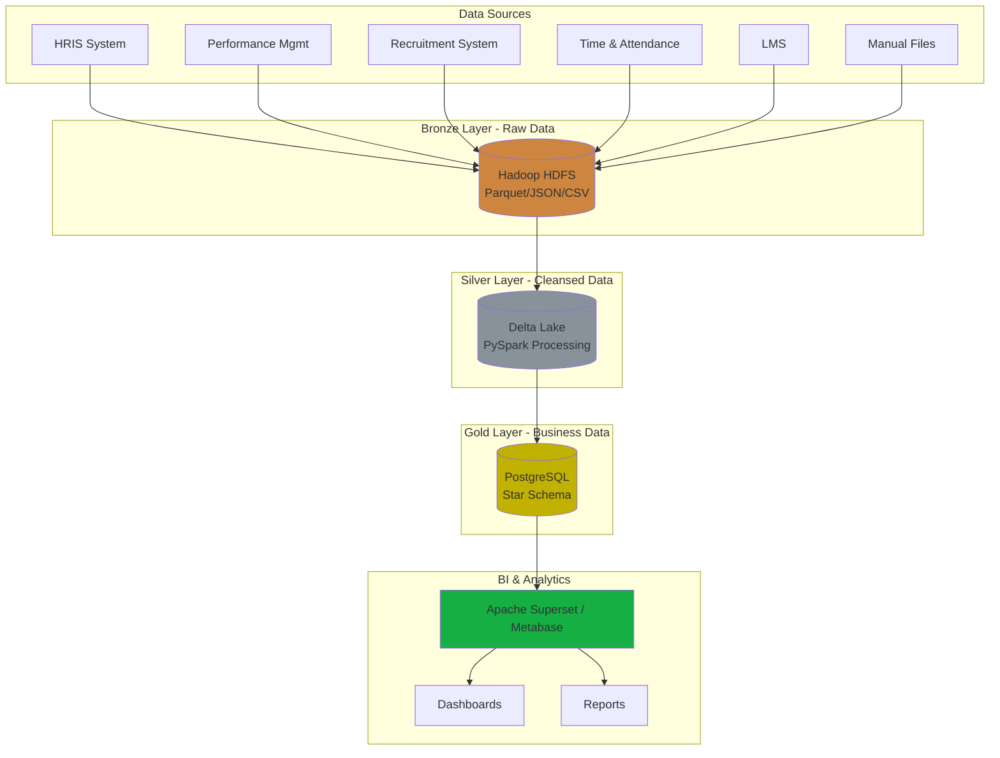
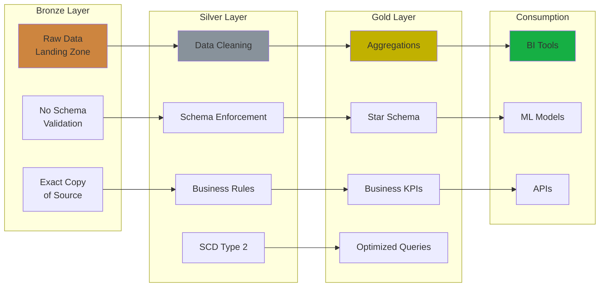
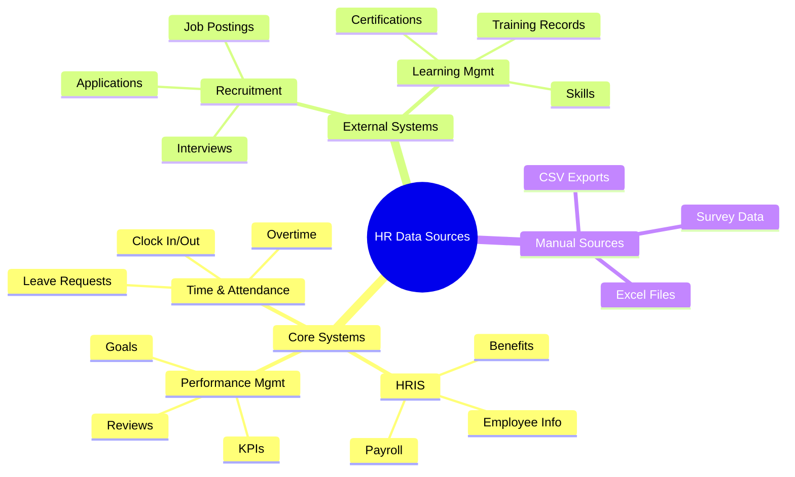
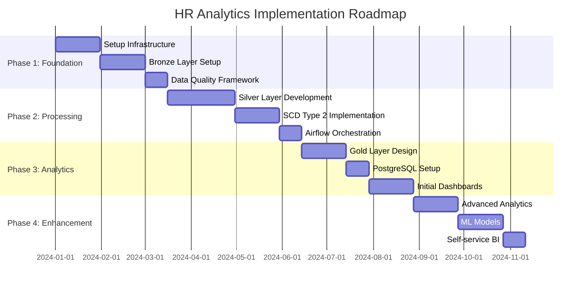
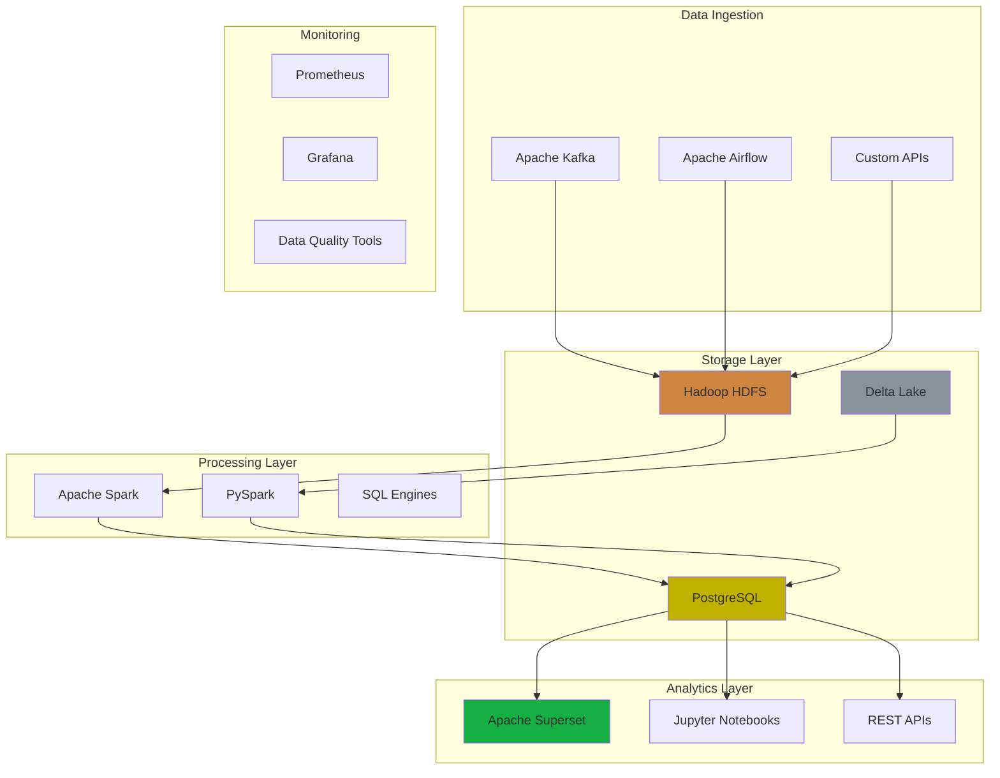

# HR Analytics Database Architecture - Lakehouse with Medallion Architecture

## Overview

This document presents the database architecture for building an HR Analytics system using the Lakehouse model with Medallion Architecture. This architecture is designed to process data from multiple sources and provide powerful analytics capabilities for human resource decision-making.

## Architecture Overview Diagram



## Medallion Architecture Flow



## 1. Architecture Overview

### 1.1. Lakehouse Model
Lakehouse combines the advantages of Data Lake (flexible storage) and Data Warehouse (high query performance), enabling:
- Storage of structured and unstructured data
- Batch and streaming processing
- Support for machine learning and analytics
- Metadata management and schema evolution

### 1.2. Medallion Architecture
The architecture divides data into 3 main layers:
- **Bronze**: Raw Data
- **Silver**: Cleansed Data
- **Gold**: Aggregated Data

## 2. Data Sources

### 2.1. Data Sources Diagram



### 2.2. Source Systems
- **HRIS (Human Resource Information System)**: Employee information, payroll, benefits
- **Performance Management System**: Performance evaluations, KPIs, objectives
- **Recruitment System**: Recruitment data, candidates, interview processes
- **Time & Attendance System**: Time tracking, leave requests, overtime
- **Learning Management System**: Training, certifications, skills
- **Manual Files**: Excel, CSV from departments

### 2.3. Data Characteristics
- **Update Frequency**: Daily, weekly, monthly
- **Format**: JSON, CSV, XML, Database dumps
- **Volume**: From few MB to few GB per day
- **Quality**: May contain missing, duplicate, inconsistent data

## 3. Bronze Layer - Raw Data Layer

### 3.1. Purpose
Store exact, unchanged copies of source data to ensure:
- Audit and traceability capabilities
- Reprocessing capabilities when needed
- Complete historical storage

### 3.2. Technology Stack
```
Storage: Hadoop HDFS / Amazon S3 / Azure Blob Storage
Format: Parquet, JSON, CSV (giữ nguyên format gốc)
Partitioning: Theo ngày, tháng, nguồn dữ liệu
```

### 3.3. Directory Structure
```
/bronze/
├── hris/
│   ├── year=2024/month=01/day=15/
│   └── year=2024/month=01/day=16/
├── performance/
├── recruitment/
├── attendance/
└── manual_files/
```

### 3.4. Ingestion Process
- **Batch Processing**: Scheduled jobs (daily, weekly)
- **Real-time**: Kafka/Event streaming for critical data
- **Manual Upload**: Interface for Excel/CSV files
- **API Integration**: REST/SOAP APIs from source systems

## 4. Silver Layer - Cleansed Data Layer

### 4.1. Purpose
Clean, standardize and consolidate data from Bronze layer:
- Data quality improvement
- Schema standardization
- Data deduplication
- Business rule application

### 4.2. Technology Stack
```
Processing Engine: Apache Spark (PySpark)
Storage Format: Delta Lake / Apache Iceberg
Data Quality: Great Expectations / Deequ
Data Governance: OpenLineage / DataHub
Orchestration: Apache Airflow
```

### 4.3. Processing Workflow

#### 4.3.1. Data Cleaning
```python
# Example PySpark code
from pyspark.sql import SparkSession
from pyspark.sql.functions import *

# Clean employee data
df_employees = spark.read.parquet("/bronze/hris/employees/")
df_clean = df_employees \
    .filter(col("employee_id").isNotNull()) \
    .withColumn("email", lower(trim(col("email")))) \
    .withColumn("phone", regexp_replace(col("phone"), "[^0-9]", "")) \
    .dropDuplicates(["employee_id"])
```

#### 4.3.2. Data Standardization
- Date format standardization
- Code mapping (department codes, job titles)
- Currency conversion
- Address standardization

#### 4.3.3. Slowly Changing Dimensions (SCD Type 2)
```python
# Handle SCD Type 2 for employee information
def apply_scd_type2(current_df, new_df, key_cols, track_cols):
    # Logic to track changes over time
    # Add effective_date, end_date, is_current
    pass
```

## 5. Gold Layer - Presentation Layer

### 5.1. Purpose
Create optimized data models for reporting and analytics:
- Pre-aggregated metrics
- Star schema optimization
- Business-ready datasets
- High-performance queries

### 5.2. Technology Stack
```
Processing: PySpark (aggregation)
Serving Database: PostgreSQL
Schema: Star Schema / Snowflake Schema
Indexing: B-tree, Bitmap indexes
```

### 5.3. Star Schema Design
``` See README.md for reference ```

## 6. Business Intelligence

**Tools**: Apache Superset or Metabase

**Main Dashboards**:

### Executive Reports
- Employee headcount over time
- Turnover rates
- HR costs

### HR Reports
- Recruitment funnel
- Time to hire
- Performance distribution

### Manager Reports
- Team performance
- Employee attendance
- Development plans

**Key Metrics**:
- Turnover rate
- Training hours
- Performance scores
- Internal promotion rate

## 7. Security and Governance

**Data Quality**:
- Automated checks at each layer
- Data error alerts
- Data lineage tracking

**Security**:
- Role-based access control
- Sensitive data encryption
- Access logging

**Compliance**:
- GDPR (right to be forgotten)
- Local labor laws
- Data retention policies

## 8. Data Governance and Security

### 8.1. Data Quality Framework
- **Validation Rules**: Automated checks at each layer
- **Monitoring**: Data quality metrics and alerting
- **Lineage Tracking**: Data source tracking
- **Documentation**: Metadata management

### 8.2. Security Measures
- **Access Control**: Role-based access (RBAC)
- **Data Masking**: PII protection in non-prod environments
- **Encryption**: At rest and in transit
- **Audit Logging**: Tracking data access and modifications

### 8.3. Compliance
- **GDPR**: Right to be forgotten, data portability
- **Local Regulations**: Compliance with local labor laws
- **Data Retention**: Policies for data storage and deletion

## 9. Implementation Roadmap

### Implementation Timeline



## 10. Monitoring and Maintenance

### 10.1. Operational Monitoring
- **Data Pipeline Health**: Success rates, execution times
- **Data Quality Metrics**: Completeness, accuracy, consistency
- **System Performance**: Resource utilization, query performance

### 10.2. Business Monitoring
- **Usage Analytics**: Dashboard views, report downloads
- **User Feedback**: Satisfaction surveys, feature requests
- **Business Impact**: Decision-making improvements

## 11. Technology Stack Overview



## 12. Conclusion

The Lakehouse with Medallion architecture for HR Analytics provides:
- **Scalability**: Handle large volumes of data
- **Flexibility**: Support multiple data types and use cases
- **Reliability**: Good data quality and governance
- **Performance**: Fast queries for analytics
- **Cost-effectiveness**: Optimized storage and compute costs

This architecture ensures organizations can make data-driven HR decisions effectively and reliably.
