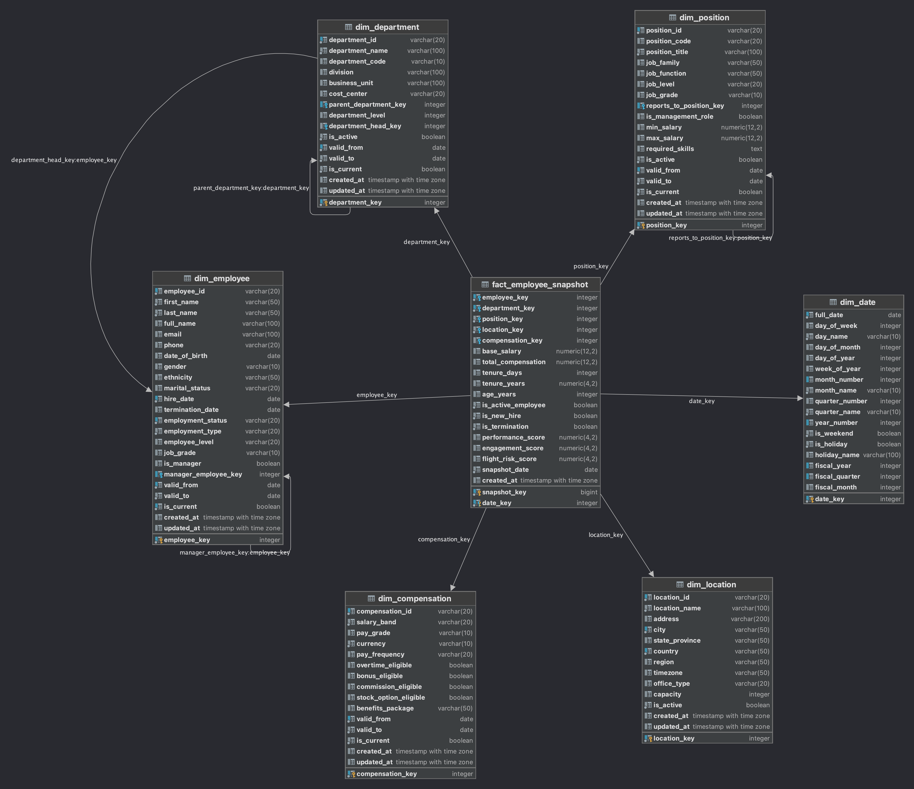
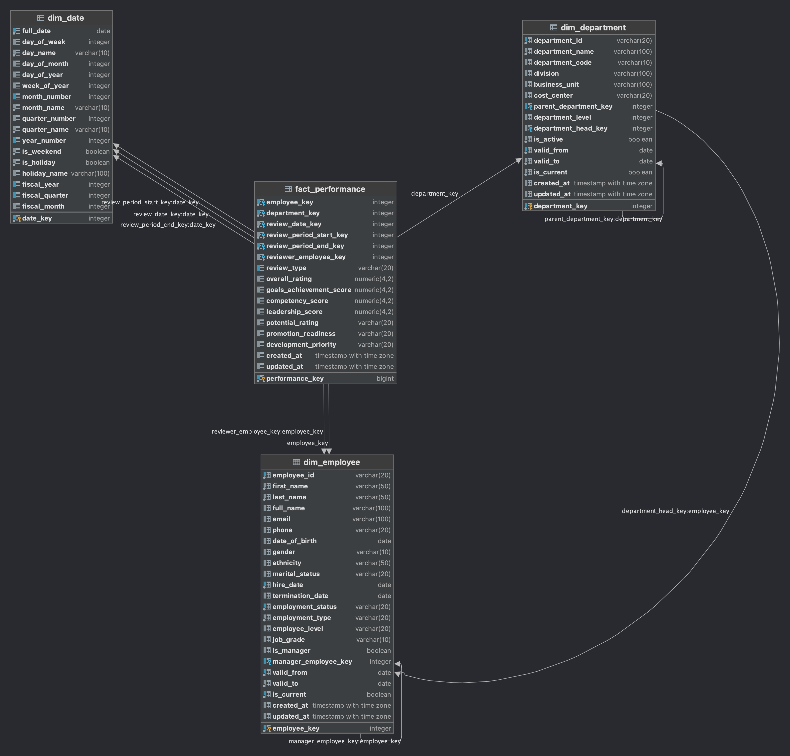
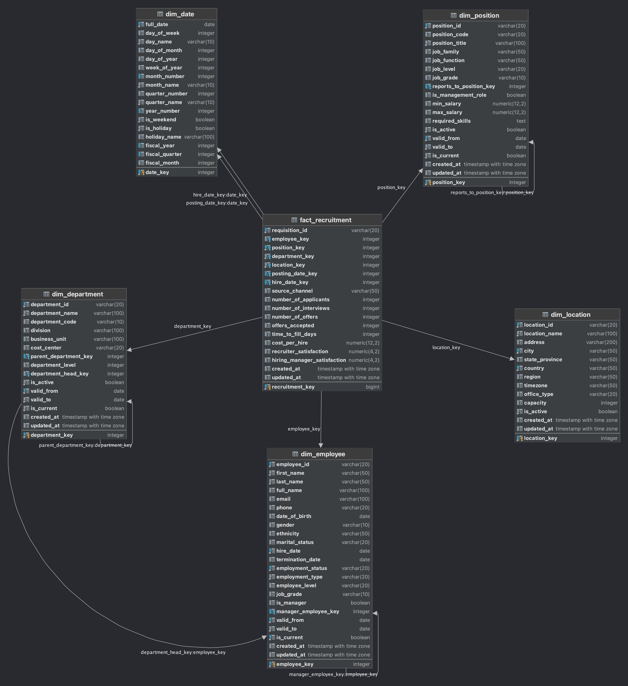
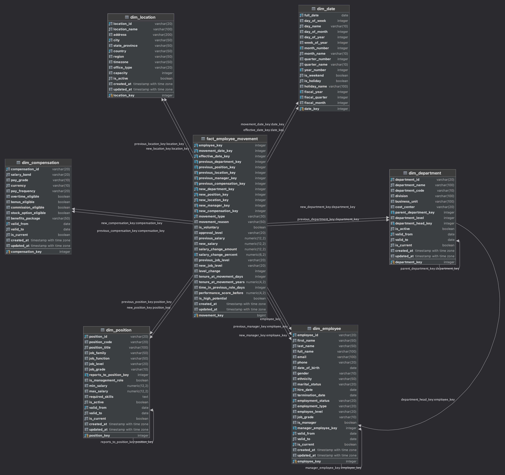
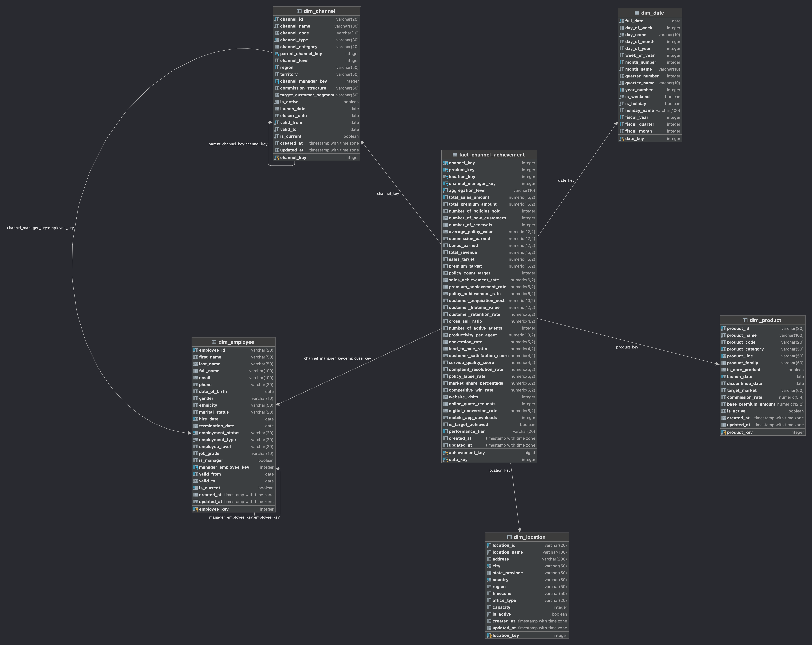
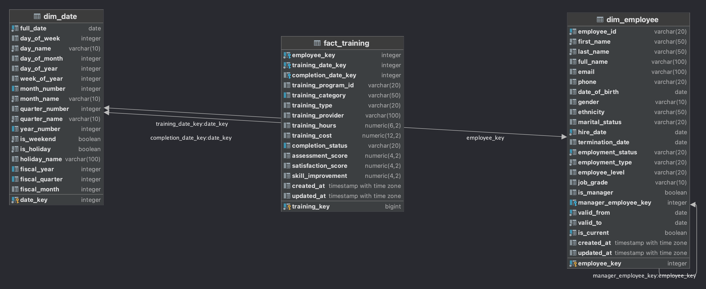
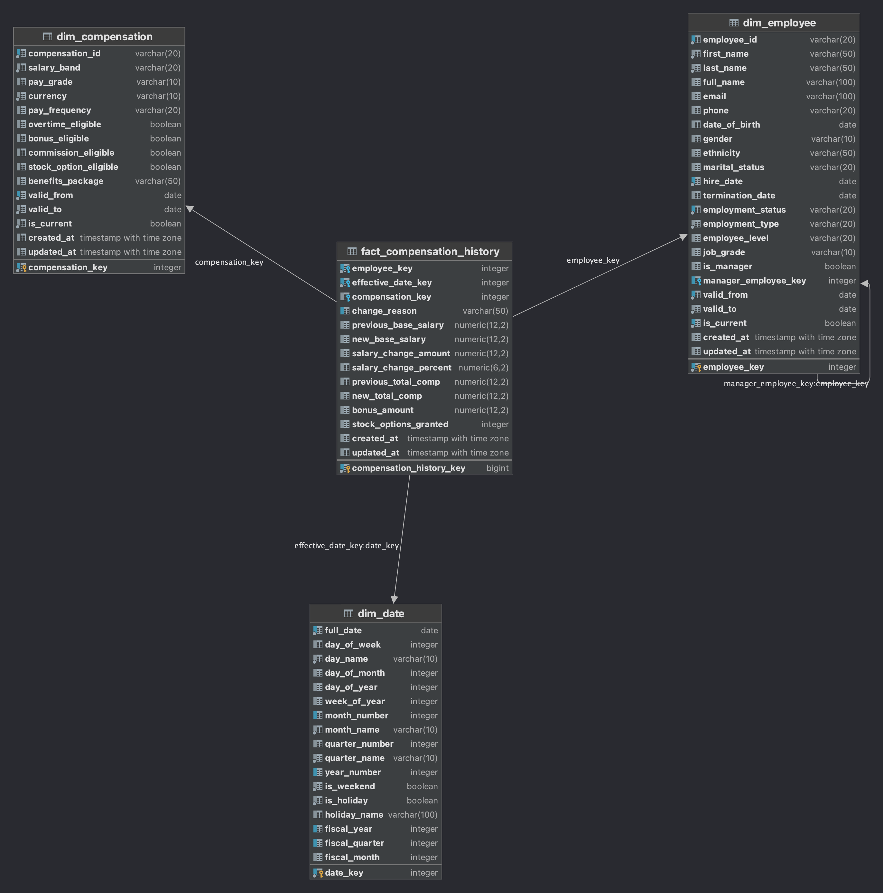

# HR Data Warehouse - Metrics & Design Specification

## 📊 1. HR METRICS FRAMEWORK

### 1.1 Core Metrics

#### Employee Demographics & Headcount
| Metric | Định nghĩa | Business Logic | Công thức tính | Tần suất báo cáo |
|--------|------------|----------------|----------------|------------------|
| **Total Headcount** | Tổng số nhân viên active tại thời điểm cụ thể | Foundation metric cho mọi phân tích HR | `COUNT(employees WHERE status = 'Active')` | Daily |
| **Headcount by Department** | Số nhân viên theo từng phòng ban | Hiểu cấu trúc tổ chức và resource allocation | `COUNT(employees) GROUP BY department` | Daily |
| **Headcount by Location** | Số nhân viên theo địa điểm làm việc | Quản lý workforce distribution | `COUNT(employees) GROUP BY location` | Daily |
| **Headcount by Employment Type** | Phân bố Full-time, Part-time, Contract | Hiểu composition của workforce | `COUNT(employees) GROUP BY employment_type` | Weekly |
| **Manager vs IC Ratio** | Tỷ lệ quản lý và nhân viên thực thi | Đánh giá organizational structure | `COUNT(managers) / COUNT(total_employees) * 100` | Monthly |

#### Turnover & Retention
| Metric | Định nghĩa | Business Logic | Công thức tính | Tần suất báo cáo |
|--------|------------|----------------|----------------|------------------|
| **Overall Turnover Rate** | Tỷ lệ nghỉ việc trong kỳ | Đo stability của workforce | `COUNT(terminations) / AVG(headcount) * 100` | Monthly |
| **Voluntary Turnover Rate** | Tỷ lệ nghỉ việc tự nguyện | Đánh giá employee satisfaction | `COUNT(voluntary_exits) / AVG(headcount) * 100` | Monthly |
| **Involuntary Turnover Rate** | Tỷ lệ sa thải | Đánh giá performance management | `COUNT(involuntary_exits) / AVG(headcount) * 100` | Monthly |
| **Retention Rate by Cohort** | Tỷ lệ giữ chân theo nhóm tuyển | Hiệu quả onboarding và development | `COUNT(retained) / COUNT(hired_in_period) * 100` | Quarterly |
| **Average Tenure** | Thời gian làm việc trung bình | Đo loyalty và stability | `AVG(tenure_at_termination OR current_tenure)` | Monthly |
| **Turnover Rate by Performance** | Turnover Rate theo performance level | Đảm bảo retain top talent | `Turnover_rate GROUP BY performance_rating` | Quarterly |

#### Recruitment Metrics
| Metric | Định nghĩa | Business Logic | Công thức tính | Tần suất báo cáo |
|--------|------------|----------------|----------------|------------------|
| **Time to Fill** | Thời gian từ khi mở vị trí đến khi hire | Đo hiệu quả quy trình tuyển dụng | `AVG(hire_date - posting_date)` | Weekly |
| **Cost per Hire** | Chi phí trung bình để tuyển 1 nhân viên | Tối ưu hóa budget tuyển dụng | `SUM(recruitment_costs) / COUNT(hires)` | Monthly |
| **Applications per Position** | Số lượng ứng viên trung bình mỗi vị trí | Đánh giá attractiveness của company | `AVG(number_of_applicants)` | Monthly |
| **Interview to Offer Ratio** | Tỷ lệ từ phỏng vấn đến offer | Hiệu quả screening process | `COUNT(offers) / COUNT(interviews)` | Weekly |
| **Offer Acceptance Rate** | Tỷ lệ chấp nhận offer | Competitive positioning | `COUNT(accepted_offers) / COUNT(offers) * 100` | Weekly |
| **Source of Hire Effectiveness** | Hiệu quả các kênh tuyển dụng | Tối ưu recruitment channels | `Quality_hires / Total_cost_by_channel` | Monthly |

#### Performance & Productivity
| Metric | Định nghĩa | Business Logic | Công thức tính | Tần suất báo cáo |
|--------|------------|----------------|----------------|------------------|
| **Performance Rating Distribution** | Phân bố điểm đánh giá | Calibration và fairness | `COUNT(*) GROUP BY rating_range` | Quarterly |
| **Goal Achievement Rate** | Tỷ lệ hoàn thành mục tiêu | Alignment với business objectives | `COUNT(goals_met) / COUNT(total_goals) * 100` | Quarterly |
| **360 Feedback Scores** | Điểm đánh giá đa chiều | Comprehensive performance view | `AVG(peer + manager + subordinate ratings)` | Semi-annually |
| **High Performer Retention** | Giữ chân top performers | Protect key talent | `Retention_rate WHERE performance >= top_20%` | Quarterly |
| **Performance Improvement Rate** | Tỷ lệ cải thiện hiệu suất | Effectiveness của development | `COUNT(improved) / COUNT(below_target) * 100` | Quarterly |

#### Employee Movements & Career Development
| Metric | Định nghĩa | Business Logic | Công thức tính | Tần suất báo cáo |
|--------|------------|----------------|----------------|------------------|
| **Internal Promotion Rate** | Tỷ lệ thăng tiến nội bộ | Career development effectiveness | `COUNT(promotions) / COUNT(total_employees) * 100` | Quarterly |
| **Lateral Transfer Rate** | Tỷ lệ chuyển đổi ngang | Cross-functional development | `COUNT(lateral_transfers) / COUNT(total_employees) * 100` | Quarterly |
| **Department Transfer Rate** | Tỷ lệ chuyển phòng ban | Organizational flexibility | `COUNT(dept_transfers) / COUNT(total_employees) * 100` | Quarterly |
| **Average Time in Role** | Thời gian trung bình trong vị trí | Role stability analysis | `AVG(time_in_role_before_movement)` | Quarterly |
| **Promotion Velocity** | Tốc độ thăng tiến | Career progression speed | `AVG(time_between_promotions)` | Quarterly |
| **Movement Success Rate** | Tỷ lệ thành công sau di chuyển | Movement effectiveness | `COUNT(successful_movements) / COUNT(total_movements) * 100` | Quarterly |
| **High Potential Movement Rate** | Tỷ lệ di chuyển của nhân tài | Talent development tracking | `COUNT(hi_po_movements) / COUNT(hi_po_employees) * 100` | Quarterly |

#### Business Achievements of Distributed Channels
| Metric | Định nghĩa | Business Logic | Công thức tính | Tần suất báo cáo |
|--------|------------|----------------|----------------|------------------|
| **Channel Sales Performance** | Doanh số bán hàng theo kênh | Track revenue by distribution channel | `SUM(total_sales_amount) GROUP BY channel` | Monthly |
| **Premium Achievement Rate** | Tỷ lệ đạt phí bảo hiểm | Monitor premium collection vs target | `(total_premium_amount / premium_target) * 100` | Monthly |
| **Policy Sales Volume** | Số lượng hợp đồng bán được | Track policy sales by channel | `COUNT(policies_sold) GROUP BY channel, period` | Monthly |
| **Customer Acquisition Rate** | Tỷ lệ thu hút khách hàng mới | New customer growth by channel | `COUNT(new_customers) / total_prospects * 100` | Monthly |
| **Channel Productivity** | Năng suất kênh phân phối | Revenue per active agent/channel | `total_sales_amount / number_of_active_agents` | Monthly |
| **Market Share by Channel** | Thị phần theo kênh | Competitive positioning | `channel_sales / total_market_sales * 100` | Quarterly |
| **Digital Conversion Rate** | Tỷ lệ chuyển đổi kênh số | Online channel effectiveness | `online_sales / website_visits * 100` | Monthly |

### 1.2 Extended Metrics

#### Compensation & Benefits
| Metric | Định nghĩa | Business Logic | Công thức tính | Tần suất báo cáo |
|--------|------------|----------------|----------------|------------------|
| **Salary vs Market Benchmark** | So sánh lương với thị trường | Competitive positioning | `(Internal_salary / Market_salary - 1) * 100` | Annually |
| **Compensation Ratio by Level** | Tỷ lệ lương theo cấp bậc | Internal equity | `AVG(salary) GROUP BY job_level` | Quarterly |
| **Benefits Utilization Rate** | Tỷ lệ sử dụng benefits | ROI của benefits package | `COUNT(users) / COUNT(eligible) * 100` | Monthly |
| **Total Compensation Cost per Employee** | Chi phí nhân sự trung bình | Budget planning | `SUM(total_comp) / COUNT(employees)` | Monthly |

#### Learning & Development
| Metric | Định nghĩa | Business Logic | Công thức tính | Tần suất báo cáo |
|--------|------------|----------------|----------------|------------------|
| **Training Hours per Employee** | Giờ đào tạo trung bình | Investment in development | `SUM(training_hours) / COUNT(employees)` | Monthly |
| **Training Completion Rate** | Tỷ lệ hoàn thành đào tạo | Engagement với learning | `COUNT(completed) / COUNT(enrolled) * 100` | Monthly |
| **Skill Gap Analysis** | Phân tích khoảng cách kỹ năng | Strategic workforce planning | `Required_skills - Current_skills` | Quarterly |
| **Internal Promotion Rate** | Tỷ lệ thăng tiến nội bộ | Career development effectiveness | `COUNT(internal_promotions) / COUNT(total_promotions) * 100` | Quarterly |

#### Employee Engagement & Culture
| Metric | Định nghĩa | Business Logic | Công thức tính | Tần suất báo cáo |
|--------|------------|----------------|----------------|------------------|
| **Employee Net Promoter Score (eNPS)** | Mức độ recommend công ty | Overall satisfaction | `% Promoters - % Detractors` | Quarterly |
| **Engagement Survey Scores** | Điểm khảo sát gắn kết | Employee experience | `AVG(engagement_scores)` | Semi-annually |
| **Work-Life Balance Index** | Chỉ số cân bằng cuộc sống | Wellbeing và sustainability | `Composite score from multiple factors` | Quarterly |
| **Diversity & Inclusion Index** | Chỉ số đa dạng và hòa nhập | Inclusive culture | `Weighted average of D&I metrics` | Quarterly |
| **Internal Mobility Rate** | Tỷ lệ di chuyển nội bộ | Career opportunities | `COUNT(internal_moves) / COUNT(employees) * 100` | Quarterly |

#### Predictive Analytics
| Metric | Định nghĩa | Business Logic | Công thức tính | Tần suất báo cáo |
|--------|------------|----------------|----------------|------------------|
| **Flight Risk Score** | Điểm rủi ro nghỉ việc | Proactive retention | `ML model based on multiple factors` | Monthly |
| **Performance Prediction** | Dự đoán hiệu suất | Early intervention | `Predictive model using historical data` | Quarterly |
| **Succession Planning Readiness** | Sẵn sàng kế nhiệm | Business continuity | `COUNT(ready_successors) / COUNT(key_positions)` | Quarterly |
| **Skill Demand Forecasting** | Dự báo nhu cầu kỹ năng | Strategic hiring | `Future_business_needs - Current_capabilities` | Annually |

#### Compliance & Risk
| Metric | Định nghĩa | Business Logic | Công thức tính | Tần suất báo cáo |
|--------|------------|----------------|----------------|------------------|
| **Training Compliance Rate** | Tỷ lệ tuân thủ đào tạo bắt buộc | Legal và regulatory compliance | `COUNT(compliant) / COUNT(required) * 100` | Monthly |
| **Safety Incident Rate** | Tỷ lệ tai nạn lao động | Workplace safety | `COUNT(incidents) / Total_hours_worked * 200000` | Monthly |
| **Grievance Resolution Time** | Thời gian giải quyết khiếu nại | Employee relations | `AVG(resolution_date - filing_date)` | Monthly |
| **Audit Findings** | Phát hiện kiểm toán | Process compliance | `COUNT(findings) by severity` | Quarterly |

## 🏗️ 2. DIMENSIONAL MODEL DESIGN

### 2.1 Dimension Tables

#### dim_employee
**Mục đích**: Lưu trữ thông tin chi tiết về nhân viên với Slowly Changing Dimension Type 2

| Column | Data Type | Description | Business Rules |
|--------|-----------|-------------|----------------|
| `employee_key` | INT | Surrogate key (PK) | Auto-increment |
| `employee_id` | VARCHAR(20) | Business key | Unique, not null |
| `first_name` | VARCHAR(50) | Tên | Not null |
| `last_name` | VARCHAR(50) | Họ | Not null |
| `full_name` | VARCHAR(100) | Họ tên đầy đủ | Computed field |
| `email` | VARCHAR(100) | Email công ty | Unique |
| `phone` | VARCHAR(20) | Số điện thoại | |
| `date_of_birth` | DATE | Ngày sinh | For age calculation |
| `gender` | VARCHAR(10) | Giới tính | Male/Female/Other |
| `ethnicity` | VARCHAR(50) | Dân tộc | For diversity analysis |
| `marital_status` | VARCHAR(20) | Tình trạng hôn nhân | |
| `hire_date` | DATE | Ngày vào làm | Not null |
| `termination_date` | DATE | Ngày nghỉ việc | Null if active |
| `employment_status` | VARCHAR(20) | Trạng thái làm việc | Active/Terminated/On Leave |
| `employment_type` | VARCHAR(20) | Loại hợp đồng | Full-time/Part-time/Contract |
| `employee_level` | VARCHAR(20) | Cấp bậc | Junior/Senior/Manager/Director |
| `job_grade` | VARCHAR(10) | Bậc lương | A1, A2, B1, etc. |
| `is_manager` | BOOLEAN | Có phải quản lý | For hierarchy analysis |
| `manager_employee_key` | INT | FK to manager | Self-referencing |
| `valid_from` | DATE | Ngày hiệu lực | SCD Type 2 |
| `valid_to` | DATE | Ngày hết hiệu lực | SCD Type 2 |
| `is_current` | BOOLEAN | Bản ghi hiện tại | SCD Type 2 |

**Indexes**:
- Primary: employee_key
- Unique: employee_id + valid_from
- Foreign: manager_employee_key

#### dim_department
**Mục đích**: Cấu trúc tổ chức và hierarchy phòng ban

| Column | Data Type | Description | Business Rules |
|--------|-----------|-------------|----------------|
| `department_key` | INT | Surrogate key (PK) | Auto-increment |
| `department_id` | VARCHAR(20) | Business key | Unique, not null |
| `department_name` | VARCHAR(100) | Tên phòng ban | Not null |
| `department_code` | VARCHAR(10) | Mã phòng ban | Unique |
| `division` | VARCHAR(50) | Khối/Division | |
| `business_unit` | VARCHAR(50) | Đơn vị kinh doanh | |
| `cost_center` | VARCHAR(20) | Trung tâm chi phí | For budget allocation |
| `parent_department_key` | INT | FK to parent dept | Self-referencing |
| `department_level` | INT | Cấp độ trong hierarchy | 1=Division, 2=Dept, 3=Team |
| `department_head_key` | INT | FK to employee | Department manager |
| `is_active` | BOOLEAN | Phòng ban còn hoạt động | |
| `valid_from` | DATE | Ngày hiệu lực | SCD Type 2 |
| `valid_to` | DATE | Ngày hết hiệu lực | SCD Type 2 |
| `is_current` | BOOLEAN | Bản ghi hiện tại | SCD Type 2 |

#### dim_position
**Mục đích**: Thông tin vị trí công việc và job families

| Column | Data Type | Description | Business Rules |
|--------|-----------|-------------|----------------|
| `position_key` | INT | Surrogate key (PK) | Auto-increment |
| `position_id` | VARCHAR(20) | Business key | Unique, not null |
| `position_code` | VARCHAR(20) | Mã vị trí | Unique |
| `position_title` | VARCHAR(100) | Tên vị trí | Not null |
| `job_family` | VARCHAR(50) | Nhóm công việc | Engineering, Sales, etc. |
| `job_function` | VARCHAR(50) | Nhóm con | Software Dev, Data Science |
| `job_level` | VARCHAR(20) | Cấp độ | Junior, Senior, Lead, Manager |
| `job_grade` | VARCHAR(10) | Bậc lương | A1, A2, B1, etc. |
| `reports_to_position_key` | INT | FK to manager position | Hierarchy |
| `is_management_role` | BOOLEAN | Có phải vị trí quản lý | |
| `min_salary` | DECIMAL(12,2) | Lương tối thiểu | Salary band |
| `max_salary` | DECIMAL(12,2) | Lương tối đa | Salary band |
| `required_skills` | TEXT | Kỹ năng yêu cầu | JSON format |
| `is_active` | BOOLEAN | Vị trí còn mở | |
| `valid_from` | DATE | Ngày hiệu lực | SCD Type 2 |
| `valid_to` | DATE | Ngày hết hiệu lực | SCD Type 2 |
| `is_current` | BOOLEAN | Bản ghi hiện tại | SCD Type 2 |

#### dim_location
**Mục đích**: Thông tin địa điểm làm việc

| Column | Data Type | Description | Business Rules |
|--------|-----------|-------------|----------------|
| `location_key` | INT | Surrogate key (PK) | Auto-increment |
| `location_id` | VARCHAR(20) | Business key | Unique, not null |
| `location_name` | VARCHAR(100) | Tên địa điểm | Not null |
| `address` | VARCHAR(200) | Địa chỉ | |
| `city` | VARCHAR(50) | Thành phố | Not null |
| `state_province` | VARCHAR(50) | Tỉnh/Bang | |
| `country` | VARCHAR(50) | Quốc gia | Not null |
| `region` | VARCHAR(50) | Khu vực | APAC, EMEA, Americas |
| `timezone` | VARCHAR(50) | Múi giờ | UTC+7, etc. |
| `office_type` | VARCHAR(20) | Loại văn phòng | HQ/Branch/Remote |
| `capacity` | INT | Sức chứa | Number of seats |
| `is_active` | BOOLEAN | Còn hoạt động | |

#### dim_date
**Mục đích**: Dimension thời gian với fiscal calendar

| Column | Data Type | Description | Business Rules |
|--------|-----------|-------------|----------------|
| `date_key` | INT | Surrogate key (PK) | YYYYMMDD format |
| `full_date` | DATE | Ngày đầy đủ | Not null |
| `day_of_week` | INT | Thứ trong tuần | 1=Monday, 7=Sunday |
| `day_name` | VARCHAR(10) | Tên thứ | Monday, Tuesday, etc. |
| `day_of_month` | INT | Ngày trong tháng | 1-31 |
| `day_of_year` | INT | Ngày trong năm | 1-366 |
| `week_of_year` | INT | Tuần trong năm | 1-53 |
| `month_number` | INT | Số tháng | 1-12 |
| `month_name` | VARCHAR(10) | Tên tháng | January, February, etc. |
| `quarter_number` | INT | Quý | 1-4 |
| `quarter_name` | VARCHAR(10) | Tên quý | Q1, Q2, Q3, Q4 |
| `year_number` | INT | Năm | 2020, 2021, etc. |
| `fiscal_year` | INT | Năm tài chính | May differ from calendar |
| `fiscal_quarter` | INT | Quý tài chính | 1-4 |
| `fiscal_month` | INT | Tháng tài chính | 1-12 |
| `is_weekend` | BOOLEAN | Cuối tuần | Saturday/Sunday |
| `is_holiday` | BOOLEAN | Ngày lễ | National holidays |
| `holiday_name` | VARCHAR(50) | Tên ngày lễ | If applicable |

#### dim_compensation
**Mục đích**: Cấu trúc lương thưởng và benefits

| Column | Data Type | Description | Business Rules |
|--------|-----------|-------------|----------------|
| `compensation_key` | INT | Surrogate key (PK) | Auto-increment |
| `compensation_id` | VARCHAR(20) | Business key | Unique, not null |
| `salary_band` | VARCHAR(20) | Band lương | Band A, Band B, etc. |
| `pay_grade` | VARCHAR(10) | Bậc lương | A1, A2, B1, etc. |
| `currency` | VARCHAR(10) | Đơn vị tiền tệ | VND, USD, etc. |
| `pay_frequency` | VARCHAR(20) | Tần suất trả lương | Monthly, Bi-weekly |
| `overtime_eligible` | BOOLEAN | Đủ điều kiện OT | |
| `bonus_eligible` | BOOLEAN | Đủ điều kiện bonus | |
| `commission_eligible` | BOOLEAN | Đủ điều kiện hoa hồng | |
| `stock_option_eligible` | BOOLEAN | Đủ điều kiện cổ phiếu | |
| `benefits_package` | VARCHAR(50) | Gói benefits | Standard, Premium, Executive |
| `valid_from` | DATE | Ngày hiệu lực | SCD Type 2 |
| `valid_to` | DATE | Ngày hết hiệu lực | SCD Type 2 |
| `is_current` | BOOLEAN | Bản ghi hiện tại | SCD Type 2 |

#### dim_channel
**Mục đích**: Thông tin các kênh phân phối và cấu trúc kênh

| Column | Data Type | Description | Business Rules |
|--------|-----------|-------------|----------------|
| `channel_key` | INT | Surrogate key (PK) | Auto-increment |
| `channel_id` | VARCHAR(20) | Business key | Unique, not null |
| `channel_name` | VARCHAR(100) | Tên kênh phân phối | Not null |
| `channel_code` | VARCHAR(10) | Mã kênh | Unique |
| `channel_type` | VARCHAR(30) | Loại kênh | Branch/Agent/Bancassurance/Online/Mobile/Call Center/Partner |
| `channel_category` | VARCHAR(20) | Phân loại kênh | Traditional/Digital/Hybrid |
| `parent_channel_key` | INT | FK to parent channel | Self-referencing |
| `channel_level` | INT | Cấp độ trong hierarchy | 1-5 |
| `region` | VARCHAR(50) | Khu vực | |
| `territory` | VARCHAR(50) | Vùng lãnh thổ | |
| `channel_manager_key` | INT | FK to employee | Channel manager |
| `commission_structure` | VARCHAR(50) | Cấu trúc hoa hồng | |
| `target_customer_segment` | VARCHAR(50) | Phân khúc khách hàng mục tiêu | |
| `is_active` | BOOLEAN | Kênh còn hoạt động | |
| `launch_date` | DATE | Ngày ra mắt kênh | |
| `closure_date` | DATE | Ngày đóng kênh | |
| `valid_from` | DATE | Ngày hiệu lực | SCD Type 2 |
| `valid_to` | DATE | Ngày hết hiệu lực | SCD Type 2 |
| `is_current` | BOOLEAN | Bản ghi hiện tại | SCD Type 2 |

#### dim_product
**Mục đích**: Thông tin sản phẩm cho phân tích thành tích kinh doanh

| Column | Data Type | Description | Business Rules |
|--------|-----------|-------------|----------------|
| `product_key` | INT | Surrogate key (PK) | Auto-increment |
| `product_id` | VARCHAR(20) | Business key | Unique, not null |
| `product_name` | VARCHAR(100) | Tên sản phẩm | Not null |
| `product_code` | VARCHAR(20) | Mã sản phẩm | |
| `product_category` | VARCHAR(50) | Danh mục sản phẩm | Life/Health/Property/Auto |
| `product_line` | VARCHAR(50) | Dòng sản phẩm | |
| `product_family` | VARCHAR(50) | Họ sản phẩm | |
| `is_core_product` | BOOLEAN | Sản phẩm cốt lõi | |
| `launch_date` | DATE | Ngày ra mắt | |
| `discontinue_date` | DATE | Ngày ngừng bán | |
| `target_market` | VARCHAR(50) | Thị trường mục tiêu | |
| `commission_rate` | DECIMAL(5,4) | Tỷ lệ hoa hồng | 0-1 |
| `base_premium_amount` | DECIMAL(12,2) | Phí bảo hiểm cơ bản | |
| `is_active` | BOOLEAN | Sản phẩm còn hoạt động | |

### 2.2 Fact Tables

#### fact_employee_snapshot
**Mục đích**: Daily snapshot của trạng thái nhân viên cho point-in-time analysis

| Column | Data Type | Description | Business Rules |
|--------|-----------|-------------|----------------|
| `snapshot_key` | BIGINT | Surrogate key (PK) | Auto-increment |
| `date_key` | INT | FK to dim_date | Not null |
| `employee_key` | INT | FK to dim_employee | Not null |
| `department_key` | INT | FK to dim_department | Not null |
| `position_key` | INT | FK to dim_position | Not null |
| `location_key` | INT | FK to dim_location | Not null |
| `compensation_key` | INT | FK to dim_compensation | |
| **Measures** | | | |
| `base_salary` | DECIMAL(12,2) | Lương cơ bản | |
| `total_compensation` | DECIMAL(12,2) | Tổng thu nhập | Base + bonus + benefits |
| `tenure_days` | INT | Số ngày làm việc | Calculated field |
| `tenure_years` | DECIMAL(4,2) | Số năm làm việc | tenure_days / 365.25 |
| `age_years` | INT | Tuổi tại snapshot date | |
| `is_active_employee` | BOOLEAN | Nhân viên đang làm việc | |
| `is_new_hire` | BOOLEAN | Tuyển mới trong tháng | |
| `is_termination` | BOOLEAN | Nghỉ việc trong tháng | |
| `performance_score` | DECIMAL(4,2) | Điểm hiệu suất gần nhất | |
| `engagement_score` | DECIMAL(4,2) | Điểm gắn kết | From surveys |
| `flight_risk_score` | DECIMAL(4,2) | Điểm rủi ro nghỉ việc | ML prediction |

**Partitioning**: Partition by date_key (monthly)
**Indexes**:
- Primary: snapshot_key
- Composite: date_key + employee_key (unique)
- Foreign keys: All dimension keys

#### fact_performance
**Mục đích**: Dữ liệu đánh giá hiệu suất

| Column | Data Type | Description | Business Rules |
|--------|-----------|-------------|----------------|
| `performance_key` | BIGINT | Surrogate key (PK) | Auto-increment |
| `employee_key` | INT | FK to dim_employee | Not null |
| `department_key` | INT | FK to dim_department | Not null |
| `review_date_key` | INT | FK to dim_date | Review date |
| `review_period_start_key` | INT | FK to dim_date | Period start |
| `review_period_end_key` | INT | FK to dim_date | Period end |
| `reviewer_employee_key` | INT | FK to reviewer | |
| `review_type` | VARCHAR(20) | Loại đánh giá | Annual, Mid-year, Quarterly |
| **Measures** | | | |
| `overall_rating` | DECIMAL(4,2) | Điểm tổng thể | 1-5 scale |
| `goals_achievement_score` | DECIMAL(4,2) | Điểm hoàn thành mục tiêu | |
| `competency_score` | DECIMAL(4,2) | Điểm năng lực | |
| `leadership_score` | DECIMAL(4,2) | Điểm lãnh đạo | If applicable |
| `potential_rating` | VARCHAR(20) | Đánh giá tiềm năng | High, Medium, Low |
| `promotion_readiness` | VARCHAR(20) | Sẵn sàng thăng chức | Ready, Developing, Not Ready |
| `development_priority` | VARCHAR(20) | Ưu tiên phát triển | High, Medium, Low |

#### fact_turnover
**Mục đích**: Theo dõi nghỉ việc và turnover analysis

| Column | Data Type | Description | Business Rules |
|--------|-----------|-------------|----------------|
| `turnover_key` | BIGINT | Surrogate key (PK) | Auto-increment |
| `employee_key` | INT | FK to dim_employee | Not null |
| `termination_date_key` | INT | FK to dim_date | Termination date |
| `last_working_date_key` | INT | FK to dim_date | Last day worked |
| `department_key` | INT | FK to final department | |
| `position_key` | INT | FK to final position | |
| `location_key` | INT | FK to final location | |
| `termination_reason` | VARCHAR(50) | Lý do nghỉ việc | Resignation, Termination, etc. |
| `termination_type` | VARCHAR(20) | Loại nghỉ việc | Voluntary, Involuntary |
| `exit_interview_completed` | BOOLEAN | Có phỏng vấn nghỉ việc | |
| **Measures** | | | |
| `tenure_at_termination_days` | INT | Thời gian làm việc | |
| `tenure_at_termination_years` | DECIMAL(4,2) | Thời gian làm việc (năm) | |
| `age_at_termination` | INT | Tuổi khi nghỉ việc | |
| `final_salary` | DECIMAL(12,2) | Lương cuối cùng | |
| `performance_score_last` | DECIMAL(4,2) | Điểm hiệu suất cuối | |
| `regrettable_loss` | BOOLEAN | Mất mát đáng tiếc | High performer leaving |
| `rehire_eligible` | BOOLEAN | Đủ điều kiện tuyển lại | |

#### fact_recruitment
**Mục đích**: Tracking quy trình tuyển dụng và metrics

| Column | Data Type | Description | Business Rules |
|--------|-----------|-------------|----------------|
| `recruitment_key` | BIGINT | Surrogate key (PK) | Auto-increment |
| `requisition_id` | VARCHAR(20) | Mã yêu cầu tuyển dụng | Business key |
| `employee_key` | INT | FK to hired employee | Null if not hired |
| `position_key` | INT | FK to dim_position | Not null |
| `department_key` | INT | FK to dim_department | Not null |
| `location_key` | INT | FK to dim_location | Not null |
| `posting_date_key` | INT | FK to dim_date | Job posting date |
| `hire_date_key` | INT | FK to dim_date | Actual hire date |
| `source_channel` | VARCHAR(50) | Kênh tuyển dụng | LinkedIn, Referral, etc. |
| **Measures** | | | |
| `number_of_applicants` | INT | Số lượng ứng viên | |
| `number_of_interviews` | INT | Số lượng phỏng vấn | |
| `number_of_offers` | INT | Số lượng offer | |
| `offers_accepted` | INT | Số offer được chấp nhận | |
| `time_to_fill_days` | INT | Thời gian tuyển dụng | hire_date - posting_date |
| `cost_per_hire` | DECIMAL(12,2) | Chi phí tuyển dụng | Total recruitment cost |
| `recruiter_satisfaction` | DECIMAL(4,2) | Đánh giá của recruiter | 1-5 scale |
| `hiring_manager_satisfaction` | DECIMAL(4,2) | Đánh giá của hiring manager | 1-5 scale |

#### fact_employee_movement
**Mục đích**: Theo dõi di chuyển nhân viên (chuyển đổi, thăng tiến) và career development

| Column | Data Type | Description | Business Rules |
|--------|-----------|-------------|----------------|
| `movement_key` | BIGINT | Surrogate key (PK) | Auto-increment |
| `employee_key` | INT | FK to dim_employee | Not null |
| `movement_date_key` | INT | FK to dim_date | Movement decision date |
| `effective_date_key` | INT | FK to dim_date | Movement effective date |
| **Previous Position** | | | |
| `previous_department_key` | INT | FK to previous department | |
| `previous_position_key` | INT | FK to previous position | |
| `previous_location_key` | INT | FK to previous location | |
| `previous_manager_key` | INT | FK to previous manager | |
| `previous_compensation_key` | INT | FK to previous compensation | |
| **New Position** | | | |
| `new_department_key` | INT | FK to new department | Not null |
| `new_position_key` | INT | FK to new position | Not null |
| `new_location_key` | INT | FK to new location | Not null |
| `new_manager_key` | INT | FK to new manager | |
| `new_compensation_key` | INT | FK to new compensation | |
| **Movement Details** | | | |
| `movement_type` | VARCHAR(30) | Loại di chuyển | Promotion, Lateral Transfer, etc. |
| `movement_reason` | VARCHAR(50) | Lý do di chuyển | Performance, Business Need, etc. |
| `is_voluntary` | BOOLEAN | Di chuyển tự nguyện | Default TRUE |
| `approval_level` | VARCHAR(20) | Cấp phê duyệt | Manager, Director, VP, CEO |
| **Measures** | | | |
| `previous_salary` | DECIMAL(12,2) | Lương trước di chuyển | |
| `new_salary` | DECIMAL(12,2) | Lương sau di chuyển | |
| `salary_change_amount` | DECIMAL(12,2) | Mức thay đổi lương | Computed field |
| `salary_change_percent` | DECIMAL(6,2) | % thay đổi lương | Computed field |
| `previous_job_level` | VARCHAR(20) | Cấp bậc trước | |
| `new_job_level` | VARCHAR(20) | Cấp bậc sau | |
| `level_change` | INT | Thay đổi cấp bậc | 1=promotion, 0=lateral, -1=demotion |
| `tenure_at_movement_days` | INT | Thời gian làm việc tại thời điểm di chuyển | |
| `tenure_at_movement_years` | DECIMAL(4,2) | Thời gian làm việc (năm) | Computed field |
| `time_in_previous_role_days` | INT | Thời gian trong vị trí trước | |
| `performance_score_before` | DECIMAL(4,2) | Điểm hiệu suất trước di chuyển | |
| `is_high_potential` | BOOLEAN | Nhân viên tiềm năng cao | |

#### fact_channel_achievement
**Mục đích**: Theo dõi thành tích kinh doanh của các kênh phân phối theo thời gian (tháng, quý, năm)

| Column | Data Type | Description | Business Rules |
|--------|-----------|-------------|----------------|
| `achievement_key` | BIGINT | Surrogate key (PK) | Auto-increment |
| `date_key` | INT | Date dimension key | FK to dim_date |
| `channel_key` | INT | Channel dimension key | FK to dim_channel |
| `product_key` | INT | Product dimension key | FK to dim_product |
| `location_key` | INT | Location dimension key | FK to dim_location |
| `channel_manager_key` | INT | Channel manager key | FK to dim_employee |
| `aggregation_level` | VARCHAR(10) | Mức độ tổng hợp | DAILY/WEEKLY/MONTHLY/QUARTERLY/YEARLY |
| **Sales Performance** | | | |
| `total_sales_amount` | DECIMAL(15,2) | Tổng doanh số bán hàng | >= 0 |
| `total_premium_amount` | DECIMAL(15,2) | Tổng phí bảo hiểm | >= 0 |
| `number_of_policies_sold` | INT | Số hợp đồng bán được | >= 0 |
| `number_of_new_customers` | INT | Số khách hàng mới | >= 0 |
| `number_of_renewals` | INT | Số hợp đồng gia hạn | >= 0 |
| `average_policy_value` | DECIMAL(12,2) | Giá trị hợp đồng trung bình | Calculated field |
| **Revenue & Commission** | | | |
| `commission_earned` | DECIMAL(12,2) | Hoa hồng kiếm được | >= 0 |
| `bonus_earned` | DECIMAL(12,2) | Thưởng kiếm được | >= 0 |
| `total_revenue` | DECIMAL(15,2) | Tổng doanh thu | Calculated field |
| **Target vs Achievement** | | | |
| `sales_target` | DECIMAL(15,2) | Mục tiêu doanh số | >= 0 |
| `premium_target` | DECIMAL(15,2) | Mục tiêu phí bảo hiểm | >= 0 |
| `policy_count_target` | INT | Mục tiêu số hợp đồng | >= 0 |
| `sales_achievement_rate` | DECIMAL(6,2) | Tỷ lệ đạt mục tiêu doanh số | Calculated field |
| `premium_achievement_rate` | DECIMAL(6,2) | Tỷ lệ đạt mục tiêu phí | Calculated field |
| `policy_achievement_rate` | DECIMAL(6,2) | Tỷ lệ đạt mục tiêu hợp đồng | Calculated field |
| **Customer Metrics** | | | |
| `customer_acquisition_cost` | DECIMAL(10,2) | Chi phí thu hút khách hàng | >= 0 |
| `customer_lifetime_value` | DECIMAL(12,2) | Giá trị khách hàng trọn đời | >= 0 |
| `customer_retention_rate` | DECIMAL(5,2) | Tỷ lệ giữ chân khách hàng | 0-100% |
| `cross_sell_ratio` | DECIMAL(4,2) | Tỷ lệ bán chéo | >= 0 |
| **Operational Metrics** | | | |
| `number_of_active_agents` | INT | Số agent hoạt động | >= 0 |
| `productivity_per_agent` | DECIMAL(10,2) | Năng suất mỗi agent | Calculated field |
| `conversion_rate` | DECIMAL(5,2) | Tỷ lệ chuyển đổi | 0-100% |
| `lead_to_sale_ratio` | DECIMAL(4,2) | Tỷ lệ lead thành bán hàng | >= 0 |
| **Quality Metrics** | | | |
| `customer_satisfaction_score` | DECIMAL(4,2) | Điểm hài lòng khách hàng | 1-5 |
| `service_quality_score` | DECIMAL(4,2) | Điểm chất lượng dịch vụ | 1-5 |
| `complaint_resolution_rate` | DECIMAL(5,2) | Tỷ lệ giải quyết khiếu nại | 0-100% |
| `policy_lapse_rate` | DECIMAL(5,2) | Tỷ lệ hợp đồng bị hủy | 0-100% |
| **Market & Competition** | | | |
| `market_share_percentage` | DECIMAL(5,2) | Thị phần | 0-100% |
| `competitive_win_rate` | DECIMAL(5,2) | Tỷ lệ thắng cạnh tranh | 0-100% |
| **Digital Metrics** | | | |
| `website_visits` | INT | Lượt truy cập website | >= 0 |
| `online_quote_requests` | INT | Yêu cầu báo giá online | >= 0 |
| `digital_conversion_rate` | DECIMAL(5,2) | Tỷ lệ chuyển đổi số | 0-100% |
| `mobile_app_downloads` | INT | Lượt tải app mobile | >= 0 |
| **Performance Indicators** | | | |
| `is_target_achieved` | BOOLEAN | Đạt mục tiêu | Calculated field |
| `performance_tier` | VARCHAR(20) | Xếp hạng hiệu suất | Excellent/Good/Fair/Below Target |

#### fact_training
**Mục đích**: Tracking đào tạo và phát triển

| Column | Data Type | Description | Business Rules |
|--------|-----------|-------------|----------------|
| `training_key` | BIGINT | Surrogate key (PK) | Auto-increment |
| `employee_key` | INT | FK to dim_employee | Not null |
| `training_date_key` | INT | FK to dim_date | Training date |
| `completion_date_key` | INT | FK to dim_date | Completion date |
| `training_program_id` | VARCHAR(20) | Mã chương trình đào tạo | |
| `training_category` | VARCHAR(50) | Loại đào tạo | Technical, Leadership, etc. |
| `training_type` | VARCHAR(20) | Hình thức | Online, Classroom, Workshop |
| `training_provider` | VARCHAR(100) | Nhà cung cấp | Internal, External vendor |
| **Measures** | | | |
| `training_hours` | DECIMAL(6,2) | Số giờ đào tạo | |
| `training_cost` | DECIMAL(12,2) | Chi phí đào tạo | |
| `completion_status` | VARCHAR(20) | Trạng thái | Completed, In Progress, Cancelled |
| `assessment_score` | DECIMAL(4,2) | Điểm đánh giá | If applicable |
| `satisfaction_score` | DECIMAL(4,2) | Điểm hài lòng | 1-5 scale |
| `skill_improvement` | DECIMAL(4,2) | Cải thiện kỹ năng | Before/after assessment |

#### fact_compensation_history
**Mục đích**: Lịch sử thay đổi lương thưởng

| Column | Data Type | Description | Business Rules |
|--------|-----------|-------------|----------------|
| `compensation_history_key` | BIGINT | Surrogate key (PK) | Auto-increment |
| `employee_key` | INT | FK to dim_employee | Not null |
| `effective_date_key` | INT | FK to dim_date | Change effective date |
| `compensation_key` | INT | FK to dim_compensation | |
| `change_reason` | VARCHAR(50) | Lý do thay đổi | Promotion, Merit, Market Adj |
| **Measures** | | | |
| `previous_base_salary` | DECIMAL(12,2) | Lương cũ | |
| `new_base_salary` | DECIMAL(12,2) | Lương mới | |
| `salary_change_amount` | DECIMAL(12,2) | Mức thay đổi | new - previous |
| `salary_change_percent` | DECIMAL(6,2) | % thay đổi | (new/previous - 1) * 100 |
| `previous_total_comp` | DECIMAL(12,2) | Tổng thu nhập cũ | |
| `new_total_comp` | DECIMAL(12,2) | Tổng thu nhập mới | |
| `bonus_amount` | DECIMAL(12,2) | Tiền thưởng | If applicable |
| `stock_options_granted` | INT | Số cổ phiếu được cấp | |

## 📊 3. ER DIAGRAMS

### 3.1 Fact Table Entity Relationship Diagrams

Dưới đây là các sơ đồ ER (Entity Relationship Diagrams) cho từng fact table trong HR Data Warehouse, thể hiện mối quan hệ giữa các dimension tables và fact tables:

#### 3.1.1 Employee Snapshot Fact

*Sơ đồ ER cho fact_employee_snapshot - Daily snapshot của trạng thái nhân viên*

#### 3.1.2 Performance Fact

*Sơ đồ ER cho fact_performance - Dữ liệu đánh giá hiệu suất nhân viên*

#### 3.1.3 Turnover Fact

*Sơ đồ ER cho fact_turnover - Theo dõi nghỉ việc và turnover analysis*

#### 3.1.4 Recruitment Fact

*Sơ đồ ER cho fact_recruitment - Tracking quy trình tuyển dụng và metrics*

#### 3.1.5 Employee Movement Fact

*Sơ đồ ER cho fact_employee_movement - Theo dõi di chuyển nhân viên và career development*

#### 3.1.6 Channel Achievement Fact

*Sơ đồ ER cho fact_channel_achievement - Thành tích kinh doanh của các kênh phân phối*

#### 3.1.7 Training Fact

*Sơ đồ ER cho fact_training - Tracking đào tạo và phát triển nhân viên*

#### 3.1.8 Compensation History Fact

*Sơ đồ ER cho fact_compensation_history - Lịch sử thay đổi lương thưởng*

### 3.2 Key Relationships

Các sơ đồ ER trên thể hiện:

- **Star Schema Design**: Mỗi fact table được kết nối với các dimension tables thông qua foreign keys
- **Shared Dimensions**: Các dimension như `dim_employee`, `dim_date`, `dim_department` được sử dụng chung across multiple fact tables
- **Hierarchical Relationships**: Self-referencing relationships trong `dim_employee` (manager hierarchy) và `dim_department` (organizational structure)
- **Slowly Changing Dimensions**: Type 2 SCD implementation với `valid_from`, `valid_to`, và `is_current` fields
- **Business Process Modeling**: Mỗi fact table đại diện cho một business process cụ thể trong HR domain

## 🎯 4. DESIGN RATIONALE & BEST PRACTICES

### 3.1 Dimensional Modeling Principles

#### Star Schema Benefits
- **Query Performance**: Optimized for analytical queries với minimal joins
- **Simplicity**: Dễ hiểu cho business users và developers
- **Flexibility**: Dễ dàng thêm metrics mới mà không ảnh hưởng existing queries
- **Scalability**: Handle large volumes of HR data efficiently

#### Slowly Changing Dimensions (SCD)
**Type 2 SCD cho Employee, Department, Position, Compensation**:
- Preserve historical accuracy cho point-in-time reporting
- Track changes in employee attributes over time
- Support compliance và audit requirements

**Example**: Employee chuyển department
```sql
-- Old record
employee_key=1, employee_id='EMP001', department='IT',
valid_from='2023-01-01', valid_to='2024-06-30', is_current=FALSE

-- New record
employee_key=2, employee_id='EMP001', department='Finance',
valid_from='2024-07-01', valid_to='9999-12-31', is_current=TRUE
```

#### Fact Table Design Patterns

**Snapshot Facts (fact_employee_snapshot)**:
- Daily snapshots cho point-in-time analysis
- Support trending và historical comparisons
- Enable cohort analysis và retention studies

**Transaction Facts (fact_recruitment, fact_training, fact_compensation_history, fact_turnover, fact_employee_movement)**:
- Capture business events as they occur
- Support process analysis và funnel metrics
- Enable detailed drill-down capabilities
- Track employee career progression và internal mobility

**Accumulating Snapshot Facts (fact_channel_achievement)**:
- Track business achievements over time periods (monthly, quarterly, yearly)
- Support target vs achievement analysis
- Enable channel performance comparison và trend analysis
- Provide comprehensive business metrics for distributed channels

**Accumulating Snapshot Facts (fact_performance)**:
- Track milestones in business processes
- Support cycle time analysis
- Enable process optimization

### 4.2 Data Quality Framework

#### Data Validation Rules
```sql
-- Employee validation
CHECK (hire_date <= CURRENT_DATE)
CHECK (termination_date IS NULL OR termination_date >= hire_date)
CHECK (age_years BETWEEN 16 AND 100)
CHECK (employment_status IN ('Active', 'Terminated', 'On Leave'))

-- Compensation validation
CHECK (base_salary > 0)
CHECK (total_compensation >= base_salary)
CHECK (salary_change_percent BETWEEN -50 AND 200)

-- Performance validation
CHECK (overall_rating BETWEEN 1 AND 5)
CHECK (review_period_end_key >= review_period_start_key)
```

#### Audit Trail Implementation
```sql
-- Add to all tables
created_at TIMESTAMP DEFAULT CURRENT_TIMESTAMP,
created_by VARCHAR(50) DEFAULT USER,
updated_at TIMESTAMP DEFAULT CURRENT_TIMESTAMP,
updated_by VARCHAR(50) DEFAULT USER,
source_system VARCHAR(20) NOT NULL,
batch_id VARCHAR(50)
```

### 4.3 Performance Optimization

#### Partitioning Strategy
```sql
-- Fact tables partitioned by date
PARTITION BY RANGE (date_key) (
    PARTITION p2023 VALUES LESS THAN (20240101),
    PARTITION p2024 VALUES LESS THAN (20250101),
    PARTITION p2025 VALUES LESS THAN (20260101)
);
```

#### Indexing Strategy
```sql
-- Dimension tables
CREATE INDEX idx_employee_business_key ON dim_employee(employee_id, valid_from);
CREATE INDEX idx_employee_manager ON dim_employee(manager_employee_key);
CREATE INDEX idx_department_hierarchy ON dim_department(parent_department_key);

-- Fact tables
CREATE INDEX idx_snapshot_date_emp ON fact_employee_snapshot(date_key, employee_key);
CREATE INDEX idx_recruitment_dates ON fact_recruitment(posting_date_key, hire_date_key);
CREATE INDEX idx_performance_employee ON fact_performance(employee_key, review_date_key);
```

#### Aggregation Tables
```sql
-- Pre-calculated monthly summaries
CREATE TABLE agg_monthly_headcount AS
SELECT
    date_key,
    department_key,
    location_key,
    COUNT(*) as headcount,
    COUNT(CASE WHEN is_new_hire THEN 1 END) as new_hires,
    COUNT(CASE WHEN is_termination THEN 1 END) as terminations,
    AVG(tenure_years) as avg_tenure
FROM fact_employee_snapshot
GROUP BY date_key, department_key, location_key;
```

### 4.4 ETL Considerations

#### Data Sources Integration
- **HRIS System**: Employee master data, org structure
- **Payroll System**: Compensation và benefits data
- **Performance System**: Reviews và goal tracking
- **Learning Management System**: Training records
- **Recruitment System**: Hiring pipeline data
- **Survey Tools**: Engagement và satisfaction scores

#### Data Refresh Strategy
```sql
-- Daily refresh for snapshot facts
-- Real-time for critical metrics (headcount)
-- Weekly for performance data
-- Monthly for compensation changes
```

#### Error Handling
```sql
-- Data quality checks before loading
CREATE OR REPLACE PROCEDURE validate_employee_data()
BEGIN
    -- Check for duplicate employee_ids
    -- Validate date ranges
    -- Ensure referential integrity
    -- Log data quality issues
END;
```

## 📊 5. REPORTING & ANALYTICS FRAMEWORK

### 5.1 Key Performance Indicators (KPIs)

#### Executive Dashboard KPIs
- **Headcount Trend**: MoM growth rate
- **Turnover Rate**: Monthly và YTD
- **Time to Fill**: Average và by department
- **Employee Satisfaction**: Latest survey scores
- **Diversity Metrics**: Representation percentages

#### Operational Metrics
- **Recruitment Funnel**: Applications → Offers → Hires
- **Performance Distribution**: Rating percentages
- **Training Completion**: By program và department
- **Compensation Equity**: Pay gap analysis
- **Internal Mobility Trends**: Movement patterns và career progression
- **Promotion Pipeline**: Readiness và succession planning

### 5.2 Analytics Use Cases

#### Employee Demographics & Headcount
```sql
-- 1.1 Headcount by Department and Time (Year, Month, Day)
SELECT
    dt.year_number,
    dt.month_number,
    dt.full_date,
    d.department_name,
    d.division,
    COUNT(CASE WHEN f.is_active_employee = TRUE THEN 1 END) as active_headcount,
    COUNT(CASE WHEN f.is_new_hire = TRUE THEN 1 END) as new_hires,
    COUNT(CASE WHEN f.is_termination = TRUE THEN 1 END) as terminations
FROM fact_employee_snapshot f
JOIN dim_date dt ON f.date_key = dt.date_key
JOIN dim_department d ON f.department_key = d.department_key
WHERE dt.full_date >= '2024-01-01'
GROUP BY dt.year_number, dt.month_number, dt.full_date, d.department_name, d.division
ORDER BY dt.full_date DESC, d.department_name;

-- 1.2 Headcount by Role/Position and Time
SELECT 
    dt.year_number,
    dt.month_number,
    p.position_title,
    p.job_family,
    p.job_level,
    COUNT(CASE WHEN f.is_active_employee = TRUE THEN 1 END) as headcount,
    AVG(f.base_salary) as avg_salary,
    AVG(f.tenure_years) as avg_tenure
FROM fact_employee_snapshot f
JOIN dim_date dt ON f.date_key = dt.date_key
JOIN dim_position p ON f.position_key = p.position_key
WHERE f.is_active_employee = TRUE
GROUP BY dt.year_number, dt.month_number, p.position_title, p.job_family, p.job_level
ORDER BY dt.year_number DESC, dt.month_number DESC, headcount DESC;

-- 1.3 Headcount by Location and Time
SELECT 
    dt.year_number,
    dt.month_number,
    l.location_name,
    l.city,
    l.country,
    l.region,
    COUNT(CASE WHEN f.is_active_employee = TRUE THEN 1 END) as headcount,
    COUNT(CASE WHEN f.is_active_employee = TRUE AND p.is_management_role = TRUE THEN 1 END) as management_count,
    ROUND(
        COUNT(CASE WHEN f.is_active_employee = TRUE AND p.is_management_role = TRUE THEN 1 END) * 100.0 / 
        NULLIF(COUNT(CASE WHEN f.is_active_employee = TRUE THEN 1 END), 0), 2
    ) as management_ratio_percent
FROM fact_employee_snapshot f
JOIN dim_date dt ON f.date_key = dt.date_key
JOIN dim_location l ON f.location_key = l.location_key
JOIN dim_position p ON f.position_key = p.position_key
-- WHERE dt.full_date >= '2024-01-01'
GROUP BY dt.year_number, dt.month_number, l.location_name, l.city, l.country, l.region
ORDER BY dt.year_number DESC, dt.month_number DESC, headcount DESC;

-- 1.4 Multi-dimensional Headcount Analysis
SELECT 
    dt.year_number,
    dt.month_number,
    d.department_name,
    p.job_family,
    p.job_level,
    l.region,
    COUNT(CASE WHEN f.is_active_employee = TRUE THEN 1 END) as headcount,
    COUNT(CASE WHEN f.is_active_employee = TRUE AND e.gender = 'Female' THEN 1 END) as female_count,
    ROUND(
        COUNT(CASE WHEN f.is_active_employee = TRUE AND e.gender = 'Female' THEN 1 END) * 100.0 / 
        NULLIF(COUNT(CASE WHEN f.is_active_employee = TRUE THEN 1 END), 0), 2
    ) as female_ratio_percent,
    AVG(CASE WHEN f.is_active_employee = TRUE THEN f.age_years END) as avg_age,
    AVG(CASE WHEN f.is_active_employee = TRUE THEN f.tenure_years END) as avg_tenure
FROM fact_employee_snapshot f
JOIN dim_date dt ON f.date_key = dt.date_key
JOIN dim_employee e ON f.employee_key = e.employee_key AND e.is_current = TRUE
JOIN dim_department d ON f.department_key = d.department_key
JOIN dim_position p ON f.position_key = p.position_key
JOIN dim_location l ON f.location_key = l.location_key
-- WHERE dt.full_date >= '2024-01-01'
GROUP BY dt.year_number, dt.month_number, d.department_name, p.job_family, p.job_level, l.region
HAVING COUNT(CASE WHEN f.is_active_employee = TRUE THEN 1 END) > 0
ORDER BY dt.year_number DESC, dt.month_number DESC, headcount DESC;
```

#### Recruitment Funnel Analysis
```sql
-- Recruitment funnel by position
SELECT
    p.position_title,
    d.department_name,
    COUNT(*) as total_requisitions,
    AVG(r.cost_per_hire) as avg_cost_per_hire,
    AVG(r.number_of_applicants) as avg_applicants,
    AVG(r.number_of_interviews) as avg_interviews,
    AVG(r.offers_accepted) as avg_offers,
    ROUND(AVG(r.offers_accepted * 100.0 / NULLIF(r.number_of_offers, 0)), 2) as offer_acceptance_rate
FROM fact_recruitment r
JOIN dim_position p ON r.position_key = p.position_key
JOIN dim_department d ON r.department_key = d.department_key
GROUP BY p.position_title, d.department_name
ORDER BY total_requisitions DESC;

-- Recruitment funnel by source channel
SELECT
    r.source_channel,
    COUNT(*) as total_requisitions,
    AVG(r.cost_per_hire) as avg_cost_per_hire,
    AVG(r.number_of_applicants) as avg_applicants,
    AVG(r.number_of_interviews) as avg_interviews,
    AVG(r.offers_accepted) as avg_offers,
    ROUND(AVG(r.offers_accepted * 100.0 / NULLIF(r.number_of_offers, 0)), 2) as offer_acceptance_rate
FROM fact_recruitment r
GROUP BY r.source_channel
ORDER BY total_requisitions DESC;

-- Recruitment funnel by department
SELECT
    d.department_name,
    COUNT(*) as total_requisitions,
    AVG(r.cost_per_hire) as avg_cost_per_hire,
    AVG(r.number_of_applicants) as avg_applicants,
    AVG(r.number_of_interviews) as avg_interviews,
    AVG(r.offers_accepted) as avg_offers,
    ROUND(AVG(r.offers_accepted * 100.0 / NULLIF(r.number_of_offers, 0)), 2) as offer_acceptance_rate
FROM fact_recruitment r
JOIN dim_department d ON r.department_key = d.department_key
GROUP BY d.department_name
ORDER BY total_requisitions DESC;

-- Turnover analysis
SELECT
    dt.year_number,
    dt.month_number,
    d.department_name,
    d.division,
    p.job_family,
    p.job_level,
    l.region,
    COUNT(t.employee_key) as total_leavers,
    COUNT(CASE WHEN t.termination_type = 'Voluntary' THEN 1 END) as voluntary_leavers,
    COUNT(CASE WHEN t.termination_type = 'Involuntary' THEN 1 END) as involuntary_leavers,
    COUNT(CASE WHEN t.regrettable_loss = TRUE THEN 1 END) as regrettable_losses,
    AVG(t.tenure_at_termination_years) as avg_tenure_at_exit,
    AVG(t.performance_score_last) as avg_last_performance
FROM fact_turnover t
JOIN dim_date dt ON t.termination_date_key = dt.date_key
JOIN dim_department d ON t.department_key = d.department_key
JOIN dim_position p ON t.position_key = p.position_key
JOIN dim_location l ON t.location_key = l.location_key
WHERE dt.year_number >= 2023
GROUP BY dt.year_number, dt.month_number, d.department_name, d.division, p.job_family, p.job_level, l.region
ORDER BY dt.year_number DESC, dt.month_number DESC, total_leavers DESC;

-- turnover and recruitment 
SELECT
    dt.year_number,
    dt.month_number,
    d.department_name,
    d.division,
    p.job_family,
    p.job_level,
    l.region,
    COUNT(t.employee_key) as total_leavers,
    COUNT(CASE WHEN t.termination_type = 'Voluntary' THEN 1 END) as voluntary_leavers,
    COUNT(CASE WHEN t.termination_type = 'Involuntary' THEN 1 END) as involuntary_leavers,
    COUNT(CASE WHEN t.regrettable_loss = TRUE THEN 1 END) as regrettable_losses,
    AVG(t.tenure_at_termination_years) as avg_tenure_at_exit,
    AVG(t.performance_score_last) as avg_last_performance,
    COUNT(r.employee_key) as total_joiners,
    AVG(r.cost_per_hire) as avg_cost_per_hire,
    AVG(r.number_of_applicants) as avg_applicants,
    AVG(r.number_of_interviews) as avg_interviews,
    AVG(r.offers_accepted) as avg_offers,
    ROUND(AVG(r.offers_accepted * 100.0 / NULLIF(r.number_of_offers, 0)), 2) as offer_acceptance_rate
FROM fact_turnover t
JOIN dim_date dt ON t.termination_date_key = dt.date_key
JOIN dim_department d ON t.department_key = d.department_key
JOIN dim_position p ON t.position_key = p.position_key
JOIN dim_location l ON t.location_key = l.location_key
LEFT JOIN fact_recruitment r ON dt.date_key = r.hire_date_key
WHERE dt.year_number >= 2023
GROUP BY dt.year_number, dt.month_number, d.department_name, d.division, p.job_family, p.job_level, l.region
ORDER BY dt.year_number DESC, dt.month_number DESC, total_leavers DESC;

```

#### Employee Movement Analysis
```sql
-- Career progression patterns
SELECT
    movement_type,
    previous_job_level,
    new_job_level,
    COUNT(*) as movement_count,
    AVG(salary_change_percent) as avg_salary_increase,
    AVG(time_in_previous_role_days) as avg_time_in_role
FROM fact_employee_movement
WHERE movement_date_key >= 20240101
GROUP BY movement_type, previous_job_level, new_job_level
ORDER BY movement_count DESC;
```

```sql
-- Department mobility matrix
SELECT
    pd.department_name as from_department,
    nd.department_name as to_department,
    COUNT(*) as transfer_count,
    AVG(fm.salary_change_percent) as avg_salary_change
FROM fact_employee_movement fm
JOIN dim_department pd ON fm.previous_department_key = pd.department_key
JOIN dim_department nd ON fm.new_department_key = nd.department_key
WHERE fm.movement_type IN ('Department Transfer', 'Lateral Transfer')
GROUP BY pd.department_name, nd.department_name
HAVING COUNT(*) >= 5;
```

```sql
-- High potential employee movement tracking
SELECT
    e.employee_id,
    e.full_name,
    fm.movement_type,
    fm.movement_date_key,
    fm.salary_change_percent,
    fm.level_change,
    pd.department_name as from_dept,
    nd.department_name as to_dept
FROM fact_employee_movement fm
JOIN dim_employee e ON fm.employee_key = e.employee_key
JOIN dim_department pd ON fm.previous_department_key = pd.department_key
JOIN dim_department nd ON fm.new_department_key = nd.department_key
WHERE fm.is_high_potential = TRUE
AND fm.movement_date_key >= 20240101
ORDER BY fm.movement_date_key DESC;
```

#### Channel Achievement Analytics

```sql
-- Monthly channel performance summary
SELECT
    d.year_number,
    d.month_name,
    c.channel_name,
    c.channel_type,
    SUM(ca.total_sales_amount) as total_sales,
    SUM(ca.total_premium_amount) as total_premium,
    SUM(ca.number_of_policies_sold) as total_policies,
    AVG(ca.sales_achievement_rate) as avg_achievement_rate,
    COUNT(CASE WHEN ca.is_target_achieved THEN 1 END) as months_target_achieved
FROM fact_channel_achievement ca
JOIN dim_date d ON ca.date_key = d.date_key
JOIN dim_channel c ON ca.channel_key = c.channel_key
WHERE ca.aggregation_level = 'MONTHLY'
AND d.year_number = 2024
GROUP BY d.year_number, d.month_number, d.month_name, c.channel_name, c.channel_type
ORDER BY d.month_number, total_sales DESC;
```

```sql
-- Top performing channels by product category
SELECT
    c.channel_name,
    p.product_category,
    SUM(ca.total_sales_amount) as total_sales,
    SUM(ca.commission_earned) as total_commission,
    AVG(ca.customer_satisfaction_score) as avg_satisfaction,
    AVG(ca.conversion_rate) as avg_conversion_rate
FROM fact_channel_achievement ca
JOIN dim_channel c ON ca.channel_key = c.channel_key
JOIN dim_product p ON ca.product_key = p.product_key
WHERE ca.aggregation_level = 'QUARTERLY'
AND ca.date_key >= 20240101
GROUP BY c.channel_name, p.product_category
HAVING SUM(ca.total_sales_amount) > 1000000
ORDER BY total_sales DESC;
```

```sql
-- Digital vs Traditional channel comparison
SELECT
    c.channel_category,
    COUNT(DISTINCT c.channel_key) as channel_count,
    SUM(ca.total_sales_amount) as total_sales,
    AVG(ca.digital_conversion_rate) as avg_digital_conversion,
    AVG(ca.customer_acquisition_cost) as avg_acquisition_cost,
    SUM(ca.number_of_new_customers) as total_new_customers
FROM fact_channel_achievement ca
JOIN dim_channel c ON ca.channel_key = c.channel_key
WHERE ca.aggregation_level = 'MONTHLY'
AND ca.date_key >= 20240101
GROUP BY c.channel_category
ORDER BY total_sales DESC;
```

---

## 6. HR Analytics Database Architecture - Lakehouse with Medallion Architecture:
Read more: [ARCHITECTURE.md](https://github.com/toorrepuS/huyhh-amaterasu/blob/main/ARCHITECTURE.md)

## 7. SOURCE:
Read more: [README.md](https://github.com/toorrepuS/huyhh-amaterasu/tree/main)

Download DDL from: [hr_dwh_design.sql](https://github.com/toorrepuS/huyhh-amaterasu/blob/main/sql/hr_dwh_design.sql)


*Thiết kế này cung cấp foundation comprehensive cho HR analytics, từ basic reporting đến advanced predictive analytics, đảm bảo scalability và maintainability cho long-term success.*